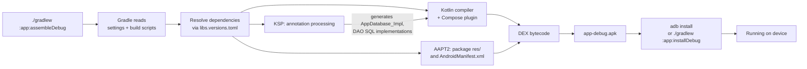
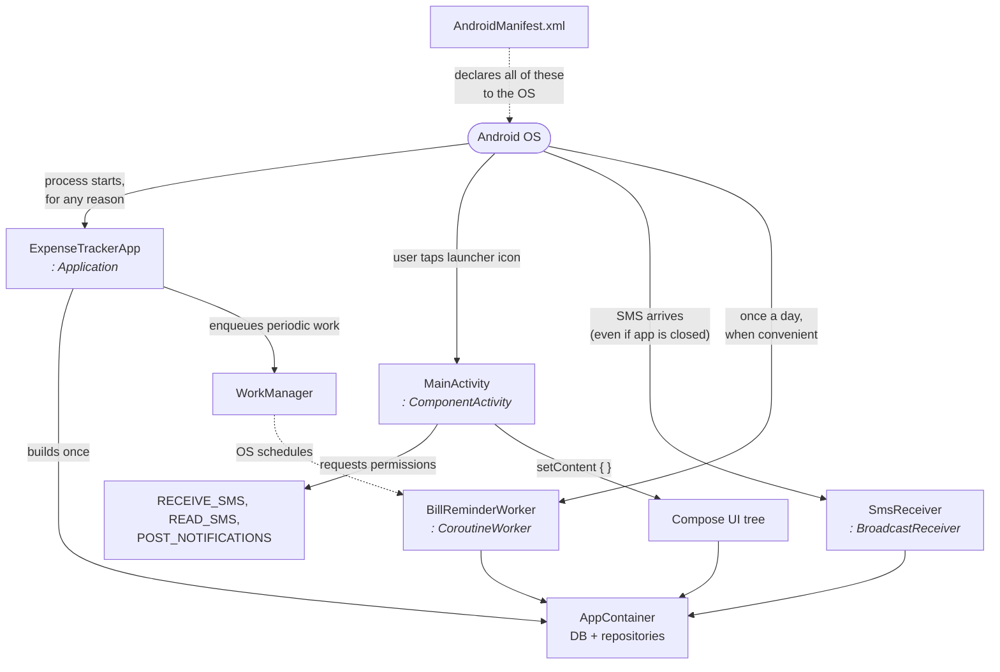
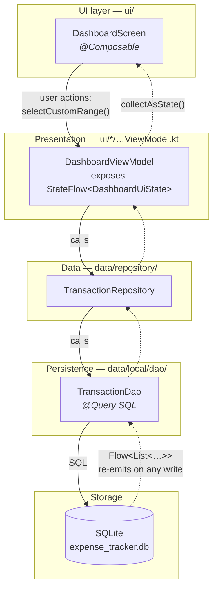
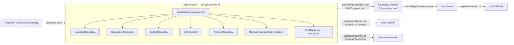
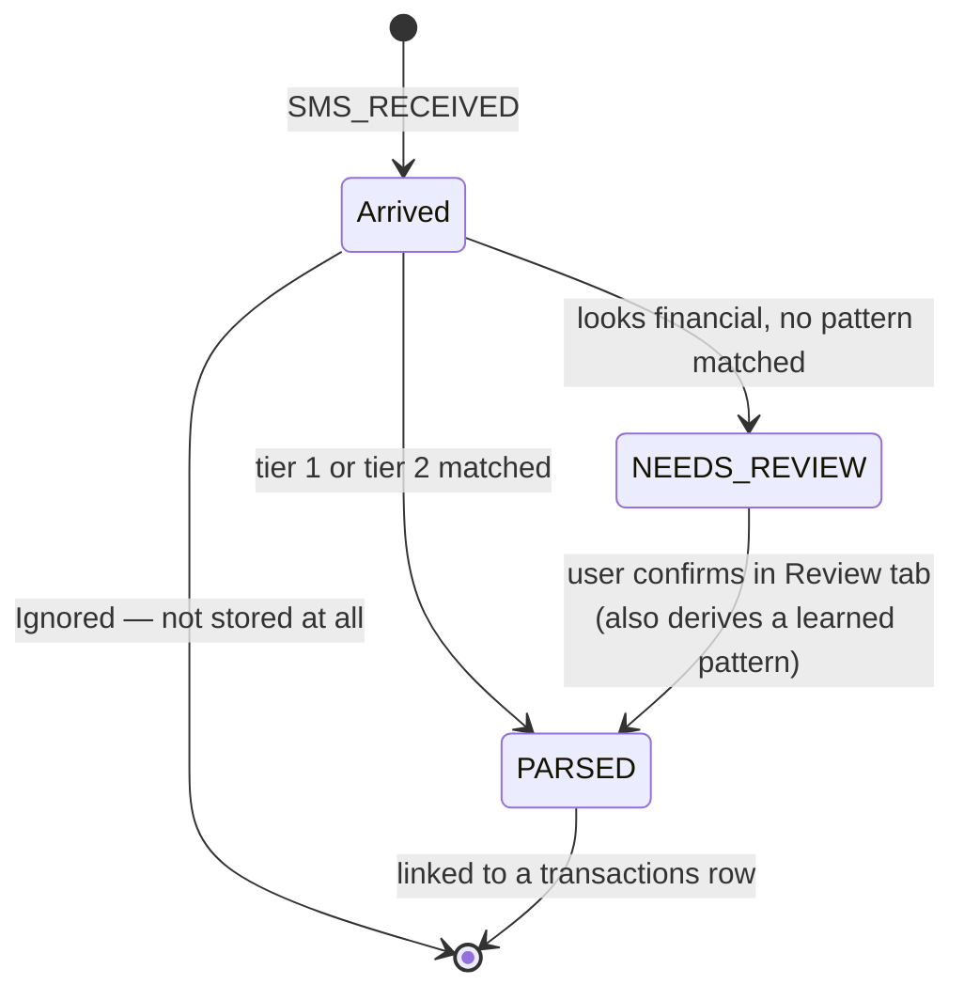
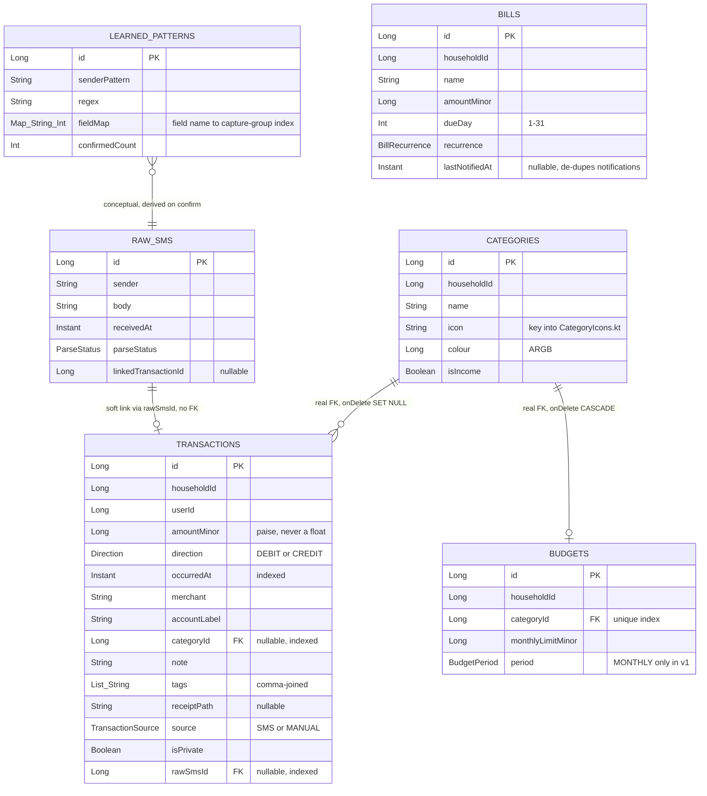
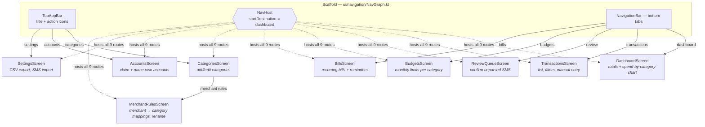

# ExpenseTracker — Architecture Guide

A tour of how this app is put together, written for someone new to Android Studio. Each section
explains the general Android concept first, then points at the exact file in this repo that uses it.

Related docs:
- [SMS_PARSING.md](SMS_PARSING.md) — which messages actually get detected, with worked examples and known gaps
- [TESTING.md](TESTING.md) — building and testing on the emulator
- [INSTALL_ON_PHONE.md](INSTALL_ON_PHONE.md) — sideloading onto a real phone
- [FUTURE_V2.md](FUTURE_V2.md) — the not-yet-built family-sharing/auth plan

> All the diagrams below are [Mermaid](https://mermaid.js.org/). They render in Android Studio's
> markdown preview (the split-pane button at the top-right of the editor) and on GitHub.

---

## 1. Orientation: project vs. module

An Android **project** is the whole repo. Inside it are one or more **modules** — independently
compiled units, each producing an APK or a library. This project has exactly one module, named
`:app`, which is the common shape for a small app. When you see `:app:assembleDebug`, read it as
"the `assembleDebug` task of the `:app` module".

```
ExpenseTracker/                  ← the project (repo root)
├── settings.gradle.kts          ← declares which modules exist; here just include(":app")
├── build.gradle.kts             ← root build script: plugin versions, custom tasks
├── gradle/
│   ├── libs.versions.toml       ← the "version catalog" — every dependency version, in one place
│   └── wrapper/                 ← pins the Gradle version itself
├── gradlew, gradlew.bat         ← the Gradle wrapper scripts you actually run
├── gradle.properties            ← JVM/AndroidX flags for the build
├── local.properties             ← YOUR machine's SDK path; git-ignored on purpose
├── .idea/                       ← Android Studio's own settings, not part of the build
└── app/                         ← the one module
    ├── build.gradle.kts         ← the build script that matters day-to-day
    ├── schemas/                 ← Room's exported DB schema (see §7)
    └── src/
        ├── main/
        │   ├── AndroidManifest.xml   ← declares components + permissions to the OS
        │   ├── java/com/example/expensetracker/   ← all Kotlin source (yes, in a folder called "java")
        │   └── res/                  ← XML resources: strings, colours, icons, themes
        ├── test/                     ← unit tests; run on your Mac's JVM, fast, no device
        └── androidTest/              ← instrumented tests; need a device/emulator
```

A few things that surprise newcomers:

| Thing | What it actually is |
| --- | --- |
| `app/src/main/java/` holding `.kt` files | A historical folder name. Kotlin sources live here; nobody renames it. |
| Two `build.gradle.kts` files | The root one configures the *build*; [app/build.gradle.kts](app/build.gradle.kts) configures the *app* — SDK levels, dependencies, Compose. This is the one you'll edit. |
| `libs.androidx.room.runtime` in the dependency list | A reference into [gradle/libs.versions.toml](gradle/libs.versions.toml). Versions live there so they're declared once. |
| `./gradlew` instead of `gradle` | The wrapper downloads and uses the exact Gradle version in [gradle/wrapper/gradle-wrapper.properties](gradle/wrapper/gradle-wrapper.properties) — currently 9.5.0 — so every machine builds identically. |
| `local.properties` | Points at `~/Library/Android/sdk` on this machine. Git-ignored, because it differs per developer. |
| `src/test` vs. `src/androidTest` | JVM tests vs. tests that need a real Android runtime. Both are currently just template stubs. |

Key settings in [app/build.gradle.kts](app/build.gradle.kts):

- `namespace` / `applicationId` = `com.example.expensetracker` — the package name and the app's unique ID on a device
- `minSdk = 24` — runs on Android 7.0 and up
- `targetSdk = 37` / `compileSdk = 37` — built against, and behaves per, the newest platform rules
- `buildFeatures { compose = true }` — turns on Jetpack Compose
- `ksp { arg("room.schemaLocation", ...) }` — makes Room write its schema JSON into `app/schemas/`

---

## 2. How a build produces an app



The step worth internalising is **KSP** (Kotlin Symbol Processing). You never write SQL-executing
code by hand in this app — you write an interface annotated `@Dao` with `@Query` strings, and KSP
generates the real implementation at build time. Two consequences:

1. A typo in a `@Query` SQL string is a **compile error**, not a runtime crash. That's a feature.
2. After changing an entity or DAO, the build must re-run before the change exists.

The root [build.gradle.kts](build.gradle.kts) also defines two convenience tasks: `rebuildApk`
(clean + assemble) and `buildAndInstall`.

---

## 3. The four ways Android enters this app

A desktop program has one `main()`. An Android app has several entry points, and the OS decides
which to call. This app uses four. Understanding this is the single biggest mental shift.



| Component | File | Lifetime and job |
| --- | --- | --- |
| `Application` | [ExpenseTrackerApp.kt](app/src/main/java/com/example/expensetracker/ExpenseTrackerApp.kt) | Created once per process, before anything else. Builds `AppContainer`, enqueues the daily bill check. Lives as long as the process. |
| `Activity` | [MainActivity.kt](app/src/main/java/com/example/expensetracker/MainActivity.kt) | One screen-worth of UI. Created when the user opens the app, destroyed on back/rotation. Requests permissions, then hands everything to Compose via `setContent { }`. |
| `BroadcastReceiver` | [data/sms/SmsReceiver.kt](app/src/main/java/com/example/expensetracker/data/sms/SmsReceiver.kt) | Woken by the OS on a system event — here, `SMS_RECEIVED`. Runs for seconds, with no UI, even if the app was never opened. |
| `Worker` | [work/BillReminderWorker.kt](app/src/main/java/com/example/expensetracker/work/BillReminderWorker.kt) | Deferred background work. WorkManager guarantees it eventually runs, surviving reboots — but chooses *when*, so a "daily" job may drift under Doze mode. |

### The manifest is the registry

[app/src/main/AndroidManifest.xml](app/src/main/AndroidManifest.xml) is how the OS learns these
classes exist. A component that isn't declared here simply never runs. Reading it top to bottom:

- Three `<uses-permission>` lines: `RECEIVE_SMS` and `READ_SMS` for parsing bank alerts,
  `POST_NOTIFICATIONS` for bill reminders. Declaring them is only half the job — on modern Android
  they must *also* be granted at runtime, which is what `MainActivity` does on first launch.
- `<application android:name=".ExpenseTrackerApp">` — this one attribute is what makes Android use
  our custom `Application` subclass instead of the default.
- `<activity android:name=".MainActivity">` with an intent-filter of `MAIN` + `LAUNCHER` — that pair
  is precisely what puts an icon in the app drawer.
- `<receiver android:name=".data.sms.SmsReceiver">` with `android:permission="BROADCAST_SMS"` — the
  guard means only the OS can trigger it, not another app faking an SMS broadcast.

---

## 4. Layers: how a screen gets its data

The app follows the standard Android layering. The important property is that **reads flow back up
as streams**: a `Flow` from the database keeps emitting, so writing a row causes the affected screens
to re-render on their own. There is no "refresh the list" call anywhere in this codebase.



One concrete path, end to end — the dashboard's spend-by-category chart:

1. [ui/dashboard/DashboardScreen.kt](app/src/main/java/com/example/expensetracker/ui/dashboard/DashboardScreen.kt)
   calls `viewModel.uiState.collectAsState()` and draws whatever it holds.
2. [DashboardViewModel.kt](app/src/main/java/com/example/expensetracker/ui/dashboard/DashboardViewModel.kt)
   `combine`s five flows (selected date range, income total, expense total, spend-by-category,
   categories) into one `DashboardUiState`, then `stateIn(...)` caches it.
3. `TransactionRepository.observeSpendByCategory(start, end)` in
   [data/repository/TransactionRepository.kt](app/src/main/java/com/example/expensetracker/data/repository/TransactionRepository.kt)
   forwards to the DAO.
4. [data/local/dao/TransactionDao.kt](app/src/main/java/com/example/expensetracker/data/local/dao/TransactionDao.kt)
   runs `SELECT categoryId, SUM(amountMinor) … GROUP BY categoryId`, returned as a `Flow`.

Why the ViewModel layer exists at all: an `Activity` is destroyed and recreated on every screen
rotation, but a `ViewModel` survives that. Anything held in a ViewModel — the selected date range,
the loaded rows — is still there afterwards, with no save/restore code.

### UI folder convention

Each feature gets one directory under `ui/`, containing a `…Screen.kt` (the Composables) and a
`…ViewModel.kt` (the state and logic):

```
ui/
├── dashboard/     DashboardScreen.kt + DashboardViewModel.kt
├── transactions/  TransactionsScreen.kt + TransactionsViewModel.kt
├── review/        ReviewQueueScreen.kt + ReviewQueueViewModel.kt
├── budgets/       BudgetsScreen.kt + BudgetsViewModel.kt
├── bills/         BillsScreen.kt + BillsViewModel.kt
├── categories/    CategoriesScreen.kt + CategoriesViewModel.kt
├── settings/      SettingsScreen.kt (no ViewModel — just triggers CSV export)
├── navigation/    NavGraph.kt + Destinations.kt   (see §8)
├── common/        shared helpers: CurrencyFormat, DateFormat, CategoryIcons, CategoryViews,
│                  LocalAppContainer, ViewModelFactories
└── theme/         Color.kt, Theme.kt, Type.kt — Material 3 colours and typography
```

Formatting helpers in `ui/common/` are worth knowing before you write new UI —
`formatMinorUnitsAsInr()` and `formatDateRange()` already exist, so don't rebuild them.

---

## 5. How a screen gets hold of a repository

Most Android apps use a dependency-injection framework such as Hilt. This one deliberately doesn't;
it wires objects by hand, which is less magic to learn while the app is small.



The three files involved:

- [di/AppContainer.kt](app/src/main/java/com/example/expensetracker/di/AppContainer.kt) — opens the
  database once and constructs all seven repositories on top of it.
- [ui/common/LocalAppContainer.kt](app/src/main/java/com/example/expensetracker/ui/common/LocalAppContainer.kt) —
  a `CompositionLocal`, i.e. an ambient value any Composable in the tree can read without it being
  passed down through every parameter list. `MainActivity` puts the container in via
  `CompositionLocalProvider`.
- [ui/common/ViewModelFactories.kt](app/src/main/java/com/example/expensetracker/ui/common/ViewModelFactories.kt) —
  `appViewModel { }` takes a lambda that builds your ViewModel, so constructor arguments work
  without reflection.

The result is a three-line preamble at the top of every screen:

```kotlin
val container = LocalAppContainer.current
val viewModel = appViewModel { DashboardViewModel(container.transactionRepository, container.categoryRepository) }
val uiState by viewModel.uiState.collectAsState()
```

Background components can't read a `CompositionLocal` — there's no Compose tree — so they cast the
application context instead: `(context.applicationContext as ExpenseTrackerApp).container`.

---

## 6. The SMS ingestion pipeline

This is the heart of the app and the flow worth understanding first. A bank SMS arrives and becomes
a transaction row with no user involvement — or, when the format isn't recognised, lands in a review
queue where confirming it once teaches the app that sender's format.

```mermaid
sequenceDiagram
    autonumber
    participant OS as Android OS
    participant RX as SmsReceiver
    participant SR as SmsRepository
    participant PS as SmsParser
    participant BT as BankTemplates<br/>tier 1
    participant LP as learned_patterns<br/>tier 2
    participant DBt as DB tables
    participant UI as ReviewQueueScreen

    OS->>RX: SMS_RECEIVED broadcast
    RX->>RX: goAsync() + launch on Dispatchers.IO
    RX->>SR: ingest(sender, body, receivedAt)
    SR->>PS: parse(sender, body)

    PS->>BT: findMatch(sender, body)
    alt tier 1 — known bank template matches
        BT-->>PS: ParsedSms
    else try tier 2 — a pattern learned earlier
        PS->>LP: getForSender(sender)
        LP-->>PS: LearnedPatternEntity or null
        PS->>PS: PatternLearner.applyToBody(...)
    end

    alt ParseOutcome.Parsed
        PS-->>SR: Parsed
        SR->>DBt: insert raw_sms (status = PARSED)
        SR->>DBt: insert transactions row (source = SMS)
        Note over DBt,UI: every screen observing transactions<br/>re-renders automatically
    else ParseOutcome.NeedsReview — looks financial but unparsed
        PS-->>SR: NeedsReview
        SR->>DBt: insert raw_sms (status = NEEDS_REVIEW)
        DBt-->>UI: appears in the review queue
        UI->>SR: confirmReview(amount, direction, merchant, category)
        SR->>DBt: insert transactions row
        SR->>DBt: update raw_sms → PARSED + linkedTransactionId
        SR->>LP: PatternLearner.derive(...) → new learned pattern
        Note over LP: the next SMS from this sender<br/>now parses on its own via tier 2
    else ParseOutcome.Ignored — not a financial message
        PS-->>SR: Ignored
        Note over SR: dropped; nothing is stored
    end
```

The files, in the order the message travels through them:

| Step | File | Note |
| --- | --- | --- |
| Receive | [data/sms/SmsReceiver.kt](app/src/main/java/com/example/expensetracker/data/sms/SmsReceiver.kt) | A receiver's `onReceive` runs on the main thread and must return fast, so it calls `goAsync()` to ask the OS for extra time, then does the DB work on `Dispatchers.IO`. Multi-part SMS are re-joined by sender first. |
| Orchestrate | [data/repository/SmsRepository.kt](app/src/main/java/com/example/expensetracker/data/repository/SmsRepository.kt) | `ingest()` and `confirmReview()` — the only two entry points into this pipeline. |
| Decide | [data/sms/SmsParser.kt](app/src/main/java/com/example/expensetracker/data/sms/SmsParser.kt) | 12 lines; the whole three-tier decision lives here. |
| Tier 1 | [data/sms/BankTemplates.kt](app/src/main/java/com/example/expensetracker/data/sms/BankTemplates.kt) | Built-in regexes per known sender. Currently one generic "Rs X debited/credited to/from Y" shape shared by all banks — a starting point, not tuned against real traffic. |
| Tier 2/3 | [data/sms/PatternLearner.kt](app/src/main/java/com/example/expensetracker/data/sms/PatternLearner.kt) | `derive()` builds a regex by finding the confirmed amount and merchant back inside the original body and replacing those spans with capture groups. `applyToBody()` replays it later. |
| Types | [data/sms/ParsedSms.kt](app/src/main/java/com/example/expensetracker/data/sms/ParsedSms.kt) | `ParsedSms` plus the `ParseOutcome` sealed interface — `Parsed` / `NeedsReview` / `Ignored`. |

Every raw message that isn't discarded is kept in `raw_sms`, so its status tells you where it is:



Three details of this pipeline are easy to miss and each exists for a reason:

- **`receivedAt` is the network's timestamp**, not `Clock.System.now()`. It is identical across
  redeliveries of the same message, which is what lets the unique `(sender, body, receivedAt)` index
  on `raw_sms` recognise a duplicate broadcast and stop it becoming a second transaction.
- **A learned pattern generalises the volatile parts of the message** — dates, times, reference
  numbers, running balances — instead of escaping them literally. Freezing them would mean no future
  message ever matched.
- **Sender lookups are normalised** (`AD-FEDBNK`, `VM-FEDBNK`, `JD-FEDBNK-S` → `FEDBNK`), because the
  operator prefix on Indian sender IDs rotates.
- **Two SMS can describe one payment.** A transfer produces both a debit alert and a confirmation,
  linked by the bank's reference; `SmsRepository.reconcileWithExisting` keeps the debit and links
  both raw messages to it, so the money isn't counted twice.
- **But two SMS can also describe one payment's *two legs*.** Moving money between your own accounts
  changes two balances, so both rows are kept and linked by `transferGroupId` instead of merged —
  merging would erase the receiving account's history. The two cases are told apart by whether the
  messages name two *different* accounts. See `TransferMatcher` and
  [SMS_PARSING.md §5c](SMS_PARSING.md).

For the behavioural side — which message formats actually match, traced examples of each of the three
outcomes, and the remaining accuracy limits — see [SMS_PARSING.md](SMS_PARSING.md).

---

## 7. The database

Persistence is [Room](https://developer.android.com/training/data-storage/room), a type-safe layer
over SQLite made of three parts:

- **Entities** — Kotlin data classes annotated `@Entity`, one per table:
  [data/local/entity/](app/src/main/java/com/example/expensetracker/data/local/entity/)
- **DAOs** — interfaces annotated `@Dao` holding the queries:
  [data/local/dao/](app/src/main/java/com/example/expensetracker/data/local/dao/)
- **The database class** — [data/local/AppDatabase.kt](app/src/main/java/com/example/expensetracker/data/local/AppDatabase.kt),
  which lists the entities, exposes the DAOs, and is opened once as a singleton.



Things worth knowing before you touch the schema:

- **Money is `Long` minor units** (paise), never `Double`. Floating-point rounding on currency is a
  classic bug; formatting back to `₹` happens only at display time, in
  [ui/common/CurrencyFormat.kt](app/src/main/java/com/example/expensetracker/ui/common/CurrencyFormat.kt).
- **`householdId` / `userId` are in every table already** even though v1 is single-user, so that the
  v2 family-sharing feature is additive rather than a painful migration. See
  [data/local/entity/Ids.kt](app/src/main/java/com/example/expensetracker/data/local/entity/Ids.kt).
- **SQLite only stores primitives.** `Instant`, `List<String>`, `Map<String, Int>` and every enum
  reach the DB through [data/local/Converters.kt](app/src/main/java/com/example/expensetracker/data/local/Converters.kt),
  registered via `@TypeConverters` on `AppDatabase`. A new non-primitive column needs a converter here.
- **Foreign-key behaviour differs on purpose.** Deleting a category nulls out `categoryId` on its
  transactions (`SET NULL` — the spending history survives) but deletes its budget (`CASCADE` — a
  budget for a non-existent category is meaningless). Note these are the *only* two declared foreign
  keys: `transactions.rawSmsId` and `raw_sms.linkedTransactionId` are plain indexed columns that the
  repository keeps in sync itself, so the database won't enforce them for you.
- **First run seeds default categories** in `AppDatabase.SeedCallback`: "Unassigned" plus eleven
  starters like Food & Dining, Investments and Salary. `onCreate` fires only when the database is
  first built, so adding to `DEFAULT_CATEGORIES` reaches existing installs only via a migration.
- **The schema is at `version = 5` with `exportSchema = true`**, so
  [app/schemas/…/5.json](app/schemas/com.example.expensetracker.data.local.AppDatabase/5.json) is a
  checked-in snapshot. Changing any entity means bumping the version and supplying a migration,
  otherwise the app crashes on launch for anyone with the old DB installed.
- **`MIGRATION_1_2` is the worked example** to copy: it adds `learned_patterns.direction` and a
  unique index on `raw_sms`, deleting pre-existing duplicates first because `CREATE UNIQUE INDEX`
  fails on a table that already violates it. It is covered by
  [MigrationTest](app/src/androidTest/java/com/example/expensetracker/data/local/MigrationTest.kt),
  which runs the upgrade against a real v1 database. There is deliberately **no**
  `fallbackToDestructiveMigration` — the DB is the user's only copy of their transactions.

---

## 8. Navigation

This is a **single-Activity** app: `MainActivity` is the only Activity, and moving between the nine
screens swaps Composables inside it rather than starting new Activities. That's the modern default —
faster transitions, one back stack, shared state — as opposed to the older one-Activity-per-screen
style you'll see in older tutorials.



- [ui/navigation/Destinations.kt](app/src/main/java/com/example/expensetracker/ui/navigation/Destinations.kt) —
  a sealed class listing each destination's route string, label and icon. `bottomBarItems` picks the
  five that get tabs; Categories, My Accounts and Settings are reachable from the top bar, and
  Merchant Rules is reached from inside Categories.
- [ui/navigation/NavGraph.kt](app/src/main/java/com/example/expensetracker/ui/navigation/NavGraph.kt) —
  the `Scaffold` and the `NavHost` that maps each route string to its Composable. Tab clicks pop back
  to the start destination first, so the back stack doesn't grow unboundedly as you tab around.

---

## 9. Where do I make change X?

| I want to… | Go to |
| --- | --- |
| Add a new screen | Create `ui/<feature>/<Name>Screen.kt` + `<Name>ViewModel.kt`, add a `Destination` in [Destinations.kt](app/src/main/java/com/example/expensetracker/ui/navigation/Destinations.kt), register a `composable(...)` in [NavGraph.kt](app/src/main/java/com/example/expensetracker/ui/navigation/NavGraph.kt) |
| Change what a screen shows | The `…ViewModel.kt` for that feature — the `Screen.kt` should mostly just render state |
| Add a query | The relevant DAO in [data/local/dao/](app/src/main/java/com/example/expensetracker/data/local/dao/), then expose it through the matching repository |
| Add a DB column or table | Edit/add an entity in [data/local/entity/](app/src/main/java/com/example/expensetracker/data/local/entity/), register it in [AppDatabase.kt](app/src/main/java/com/example/expensetracker/data/local/AppDatabase.kt), **bump `version`, and add a `Migration`** — plus a `@TypeConverter` if the type isn't a primitive |
| Fix a bank's SMS parsing | [data/sms/BankTemplates.kt](app/src/main/java/com/example/expensetracker/data/sms/BankTemplates.kt); anything it misses still degrades safely into the review queue |
| Change colours / fonts | [ui/theme/](app/src/main/java/com/example/expensetracker/ui/theme/) — `Color.kt`, `Theme.kt`, `Type.kt` |
| Change money or date formatting | [ui/common/CurrencyFormat.kt](app/src/main/java/com/example/expensetracker/ui/common/CurrencyFormat.kt) / [DateFormat.kt](app/src/main/java/com/example/expensetracker/ui/common/DateFormat.kt) |
| Change the CSV export | [export/CsvExporter.kt](app/src/main/java/com/example/expensetracker/export/CsvExporter.kt) — writes to `Android/data/<applicationId>/files/exports/` |
| Change bill reminder behaviour | [work/BillReminderWorker.kt](app/src/main/java/com/example/expensetracker/work/BillReminderWorker.kt); its schedule is set in [ExpenseTrackerApp.kt](app/src/main/java/com/example/expensetracker/ExpenseTrackerApp.kt) |
| Add a library | Add the version + library to [gradle/libs.versions.toml](gradle/libs.versions.toml), then reference it in [app/build.gradle.kts](app/build.gradle.kts) |
| Add a permission | Declare it in [AndroidManifest.xml](app/src/main/AndroidManifest.xml) **and**, if it's a runtime permission, request it in [MainActivity.kt](app/src/main/java/com/example/expensetracker/MainActivity.kt) |
| Add a new dependency for screens to use | Construct it in [di/AppContainer.kt](app/src/main/java/com/example/expensetracker/di/AppContainer.kt) — it's then reachable everywhere via `LocalAppContainer.current` |
| Build and run it | `./gradlew :app:assembleDebug`, or `./gradlew buildAndInstall`; see [TESTING.md](TESTING.md) |
